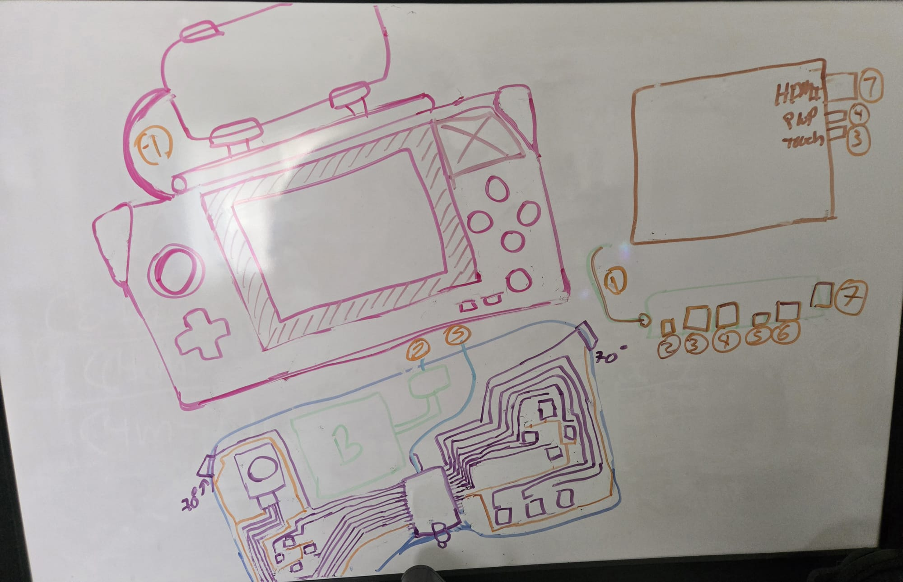

# V1 Phone-Based Prototype

## Overview

The V1 Phone-Based Prototype is the first physical development stage of
OpenEmu Handheld.

The purpose of this prototype is to test the basic handheld concept using
off-the-shelf components before more integrated electronics are developed.

The prototype uses an Android phone as the primary computing device while
the handheld provides physical controls, a secondary display, power, and
the mechanical enclosure.

This prototype is intended to help validate:

- controller ergonomics
- button and joystick placement
- secondary display integration
- phone mounting
- battery operation
- USB-C connectivity
- internal electronics placement
- cable and wire routing
- enclosure dimensions
- practical 3D printing and assembly

---

## Development Status

**Prototype:** V1 Phone-Based Prototype  
**Project release:** `v0.1.x`  
**Current prototype revision:** [FILL IN]  
**Date documented:** 2026-10-04  
**Status:** Experimental / Pre-alpha

The design is still under active development. Mechanical dimensions,
electronics placement, wiring, and individual components may change as
testing continues.

---

## Initial Concept Sketch

The image above is an early whiteboard concept used to plan the mechanical
and electronic layout of the V1 prototype.

The sketch is not intended to represent exact dimensions or finalized
electrical connections. It is primarily used to visualize how the major
components could fit together before detailed CAD and electronics work is
completed.

The sketch includes early concepts for:

- the overall handheld enclosure
- controller grip geometry
- the 7-inch secondary display
- phone positioning
- analog joystick placement
- D-pad placement
- face buttons
- additional control buttons
- internal electronics placement
- controller wiring
- wire-routing paths
- display connections
- power connections

### Numbered Sketch References

The numbered labels in the sketch currently represent these connections:

1. USB-HUB to Phone 
2. USB-HUB to Battery
3. USB-HUB to Display Power
4. USB-HUB to Display Touch
5. USB-HUB to Arduino Pro Micro 
6. N/A
7. USB-HUB to Display HDMI

These labels may be changed as the design becomes more detailed.